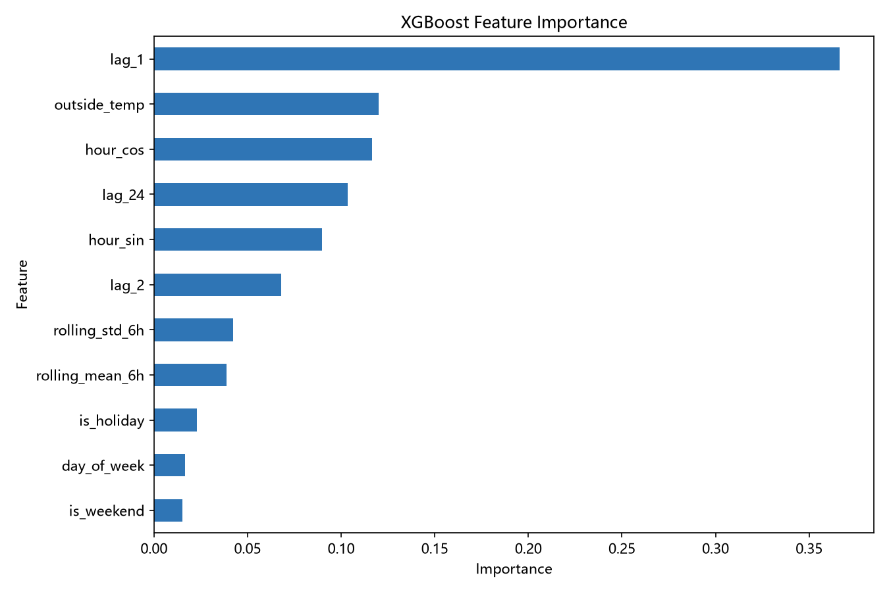
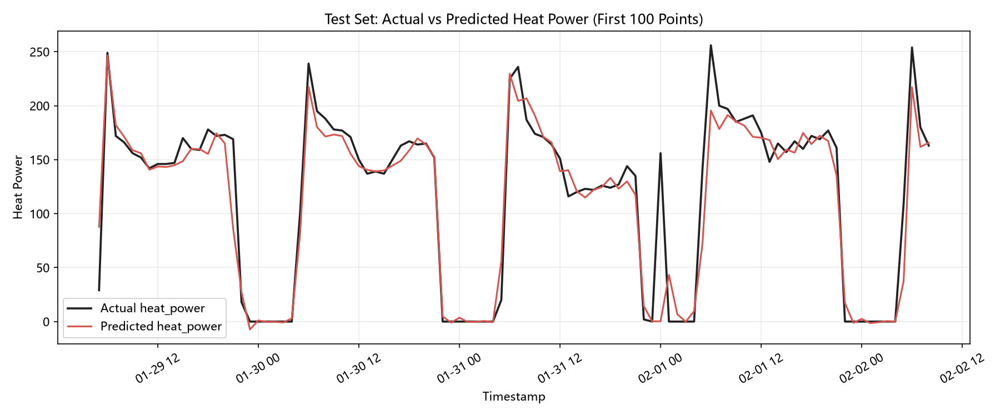
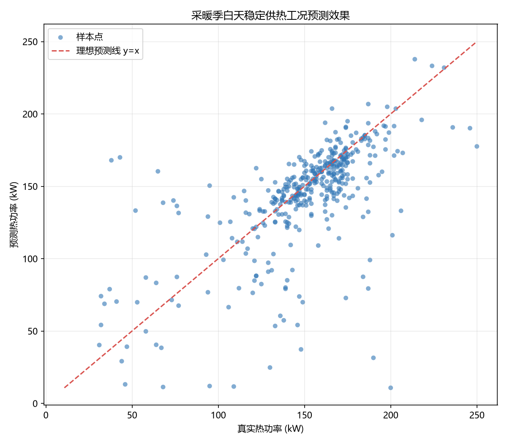

# Heat-Load-Forecast-XGBoost：换热站热负荷预测

小时级热功率预测实验项目，用于为供热调度、能耗分析和稳定供热场景评估提供数据驱动的预测参考。

## 项目状态

当前项目是一个可运行的 XGBoost 预测原型，重点验证时间序列特征、滞后负荷特征和业务工况切片评估。它不是生产系统，结果不能直接替代供热调度或自动控制决策。

## 项目背景

换热站热负荷随室外温度、小时周期、星期周期和前序负荷变化。对未来热功率进行逐时预测，可以帮助分析人员观察负荷趋势，并在稳定供热工况下评估模型是否具有实际参考价值。

## 技术方案

### 数据与目标

原始数据来自 Kaggle 公开数据集 DHS Substation Data，对应塞尔维亚 Niš 的区域供热系统。本项目使用的 CSV 文件（`heat_exchange_data.csv` 及 `heat_exchange_data_with_iforest.csv`）由配套项目 [Heat-Exchange-Station-Anomaly-Detection](https://github.com/yyy2556/Heat-Exchange-Station-Anomaly-Detection/tree/main) 生成，读取时仅使用其中三列。你也可以将自己的换热站数据整理为相同格式后使用。

- `heat_exchange_data.csv`：处理后的基础数据
- `heat_exchange_data_with_iforest.csv`：增加孤立森林检测结果列的数据

本项目读取时只选择以下三列，其他列不会进入建模：

| 类型 | 字段 | 说明 |
| --- | --- | --- |
| 时间索引 | `timestamp` | 小时级时间戳 |
| 气象特征 | `outside_temp` | 室外温度 |
| 目标变量 | `heat_power` | 热功率，单位 kW |

### 特征工程

| 特征类别 | 特征 | 说明 |
| --- | --- | --- |
| 时间特征 | `hour_sin`、`hour_cos` | 小时的正余弦周期编码 |
| 时间特征 | `day_of_week` | 星期几，0 到 6 |
| 时间特征 | `is_weekend` | 是否周末，1 或 0 |
| 滞后特征 | `lag_1`、`lag_2`、`lag_24` | 前 1、2、24 小时热功率 |
| 滚动特征 | `rolling_mean_6h`、`rolling_std_6h` | 前 6 小时热功率的滚动均值和标准差 |
| 气象特征 | `outside_temp` | 室外温度 |
| 日历特征 | `is_holiday` | 塞尔维亚法定非工作节假日，1 或 0 |

序列开头没有足够历史值的滞后和滚动特征使用 0 填充。所有滞后和滚动特征使用 `shift()` 先排除当前时刻，确保训练时不引入未来信息。数据按时间排序，并使用前 80% 训练、后 20% 测试，不随机打乱顺序，避免时间泄漏。

`is_holiday` 按数据覆盖年份（2017 至 2020）的塞尔维亚法定非工作节假日构造，包括新年、东正教圣诞节、国庆日、劳动节、东正教复活节和停战日，以及适用的周日顺延日。

### 模型

模型使用 `xgboost.XGBRegressor`：

```python
XGBRegressor(
    n_estimators=500,
    max_depth=6,
    learning_rate=0.05,
    subsample=0.8,
    colsample_bytree=0.8,
    objective="reg:squarederror",
    random_state=42,
    n_jobs=4,
)
```

XGBoost 可以拟合特征与热负荷之间的非线性关系，并提供特征重要性，适合作为这个项目的可解释基线模型。

特征重要性需要结合物理含义解读：如果 `lag_24` 或 `rolling_mean_6h` 位于 Top 1，它们通常分别表示前一天同期负荷的日周期惯性，或最近数小时负荷水平对当前热功率的影响。最终 Top 1 以当前版本实际生成的特征重要性图为准。

## 评估方法

脚本统一输出 MAE、MAPE 和 sMAPE：

- MAE：反映热功率的平均绝对误差
- MAPE：在 `y_true >= 1.0` 的正常工况子集上计算，减少接近 0 的负荷对百分比误差的放大
- sMAPE：同时输出全量测试集和各业务切片结果，作为更稳定的相对误差参考

此外，脚本会按 `y_test >= 10`、`>=20`、`>=30 kW` 进行分档评估，并分析以下业务工况：

- 工况 A：稳定供热，`y_test >= 30 kW`
- 工况 B：采暖季（11、12、1、2、3 月）+ 稳定供热
- 工况 C：白天（08:00 至 18:00）+ 稳定供热
- 工况 D：采暖季 + 白天 + 稳定供热

工况 D 用于观察业务核心时段的实际可用性，不代表模型整体泛化能力提升。

脚本还会在 `y_true >= 1.0` 的统一口径下输出工作日、周末、白天（08:00 至 18:00）和夜间（19:00 至次日 07:00）的 MAPE，便于比较模型在不同运行时段的表现。

## 运行结果示例

以下是当前本地数据运行记录中的代表性结果，实际数值会随数据文件和运行环境变化：

| 评估工况 | 样本数 | MAE | MAPE | sMAPE |
| --- | ---: | ---: | ---: | ---: |
| 稳定供热，`heat_power >= 30 kW` | 1,152 | 28.08 kW | 21.43% | 22.84% |
| 采暖季 + 白天 + 稳定供热 | 401 | 19.15 kW | 16.79% | 16.07% |

这些切片结果适合用于说明模型在核心业务工况下的表现，但不应被表述为全工况指标或生产性能承诺。

## 可视化结果







## 环境与运行

环境要求：Python 3.9 或更高版本，以及以下依赖：

- pandas
- numpy
- matplotlib
- scikit-learn
- xgboost

安装依赖：

```powershell
python -m pip install pandas numpy matplotlib scikit-learn xgboost
```

运行脚本：

```powershell
python load_forecast_xgboost.py
```

脚本会优先读取 `heat_exchange_data_with_iforest.csv`，不存在时回退到 `heat_exchange_data.csv`。图表保存到 `docs/`：

- `feature_importance.png`：特征重要性水平柱状图
- `test_prediction_vs_actual.png`：测试集前 100 个点的预测值与真实值对比
- `winter_day_stable_heating_scatter.png`：工况 D 的真实值与预测值散点图

## 项目结构

```text
project2/
├── load_forecast_xgboost.py
├── README.md
├── LICENSE
├── .gitignore
├── docs/
│   ├── feature_importance.png
│   ├── test_prediction_vs_actual.png
│   └── winter_day_stable_heating_scatter.png
└── heat_exchange_data*.csv  # 本地数据，默认被 .gitignore 忽略
```

## 限制与改进方向

当前限制：

- 使用固定 XGBoost 参数，尚未进行系统超参数搜索
- 未加入太阳辐射、风速等外部气象变量
- 工况切片用于业务分析，不等于分工况训练或整体泛化能力提升
- 原始数据及衍生 CSV 的公开发布仍需遵守 Kaggle 数据集的许可证、署名和再分发条款

后续可尝试：

1. 接入风速、太阳辐射等外部气象数据
2. 比较全工况模型与采暖季/非采暖季分工况模型
3. 系统超参数搜索（GridSearchCV 或 Optuna）
4. 加入温度变化率等派生特征

## 版本历史

| 版本 | 日期 | 关键更新 |
| --- | --- | --- |
| v1.0 | 2026-08-11 | 完成 XGBoost 热负荷预测基线、时间序列特征、滞后特征和业务工况切片评估 |
| v1.1 | 2026-08-11 | 增加 6 小时滚动统计特征（均值/标准差）、小时正余弦周期编码、塞尔维亚节假日特征，以及工作日/周末/白天/夜间分层评估体系 |

## 许可证

项目代码使用 MIT License。数据文件来自第三方数据集，数据许可不因本项目代码采用 MIT License 而自动改变；发布数据时请以原数据集适用条款为准。
